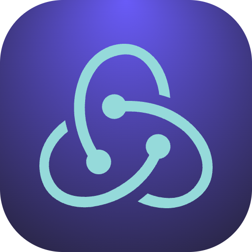

<!-- HEADER STYLE: CLASSIC -->

# NEXUS

<em>Search Engine for Notion</em>

<!-- BADGES -->

<!-- default option, no dependency badges. -->

<!-- default option, no dependency badges. -->

 

---

## Overview

**Why nexus?**

I built a semantic search engine that indexes all my Notion notes, extracts keywords using AI, and enables complex natural-language queries with autocomplete (Like Google).

- **🔍 Lockfile Management:** Ensures precise dependency versions for backend and frontend consistency.
- **🚀 Structured React Components:** Facilitates efficient search engine functionality in frontend applications.
- **💡 AI Integration:** Enables answer generation and keyword extraction using OpenAI and Ollama models.
- **🔠 Trie Data Structure:** Optimizes word search operations for enhanced performance.

---

## Features

|      | Component       | Details                              |
| :--- | :-------------- | :----------------------------------- |
| ⚙️  | **Architecture**  | <ul><li>Follows a modular architecture with separate backend and frontend directories.</li><li>Uses TypeScript for type safety and better code organization.</li></ul> |
| 🔩 | **Code Quality**  | <ul><li>Includes ESLint for code linting and Prettier for code formatting.</li><li>Uses strict TypeScript configuration for catching type errors at compile time.</li></ul> |
| 📄 | **Documentation** | <ul><li>Documentation folder present but lacks detailed documentation within the codebase.</li></ul> |
| 🔌 | **Integrations**  | <ul><li>Integrates with various npm packages like dotenv, nodemon, and openai for additional functionalities.</li></ul> |
| 🧩 | **Modularity**    | <ul><li>Codebase organized into separate modules for better maintainability and scalability.</li></ul> |
| 🧪 | **Testing**       | <ul><li>Includes testing dependencies like vitest for unit testing and zod for data validation.</li></ul> |
| ⚡️  | **Performance**   | <ul><li>No specific performance optimization mentioned in the codebase.</li></ul> |
| 🛡️ | **Security**      | <ul><li>Includes @raycast/eslint-config for security best practices in code.</li></ul> |
| 📦 | **Dependencies**  | <ul><li>Relies on various dependencies like TypeScript, ESLint, Prettier, and openai for different functionalities.</li></ul> |

---
